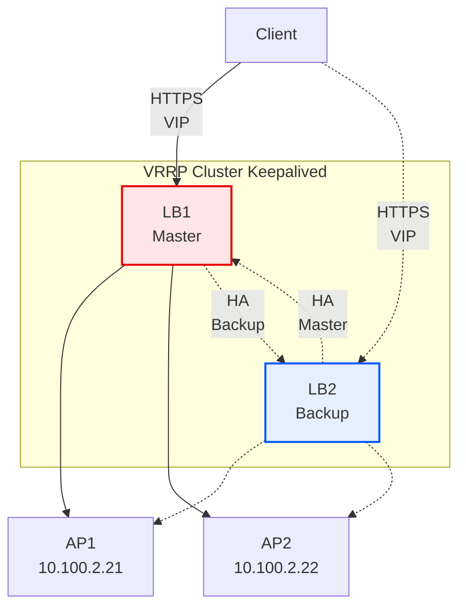

# 📘 **《雙 LB 高可用架構：Ansible 自動化實作完整指南》**

**High Availability Load Balancer Architecture with HAProxy + Keepalived + Ansible**

> **作者：哈哈班長**
> **版本：2025/10**
> **用途：教學 / 內部訓練 / 個人技術提升**

---


_圖片為 AI 生成_

---

## 📍 **1. 前言**

本文件是一套**專案級、高可用（High Availability）Load Balancer 部署自動化教材**，透過：

- **HAProxy**（L7 Reverse Proxy）
- **Keepalived + VRRP**（Virtual IP 高可用性）
- **Ansible Roles**（正式專案等級的自動化設計）

達到：

- 主 LB 掛掉 → 自動切換到備援 LB（Failover）
- 主 LB 恢復 → 自動搶回 VIP（Failback）
- AP server 自動安裝 Apache + PHP
- SSL 憑證自動佈署
- HAProxy 設定檔自動生成
- Keepalived 設定檔依主機差異自動生成
- 全程可重複、無誤差、快速部署

此專案是完整、可直接落地到公司環境的自動化架構範本。

---

## 📐 **2. 架構圖（高可用負載平衡）**



---

## 📁 **3. 專案目錄結構**

```text
ansiblekeepalived/
├── ansible.cfg
├── hosts
├── host_vars/
│   ├── lb1.yml
│   └── lb2.yml
├── site.yml
├── lb_init.yml               # optional，單獨部署 LB 時可用
├── roles/
│   ├── common/
│   │   ├── tasks/
│   │   │   └── base_init.yml
│   │   └── ...
│   ├── ap/
│   │   ├── tasks/
│   │   │   └── ap_init.yml
│   │   └── index.php
│   └── lb/
│       ├── tasks/
│       │   ├── main.yml
│       │   ├── init.yml
│       │   ├── ssl.yml
│       │   ├── haproxy.yml
│       │   └── keepalived.yml
│       ├── handlers/
│       │   └── main.yml
│       ├── templates/
│       │   ├── haproxy.cfg.j2
│       │   └── keepalived.conf.j2
│       ├── files/
│       │   └── site.pem
│       └── vars/
│           └── main.yml
```

---

:::info
註：
`roles/lb/files` 下的 
- **site.crt**
- **site.key**
- **site.pem**
 
是在 linux 用指令建立自簽 SSL 憑證（Lab 用）：

```bash!
# 用 linux 產出 `site.key` 及 `site.crt` 
openssl req -x509 -newkey rsa:2048 -nodes \
  -keyout site.key -out site.crt \
  -subj "/CN=demo-aws-lb.local" -days 365
  
# 合併成 `PEM`
cat site.key site.crt > site.pem

```
:::

---